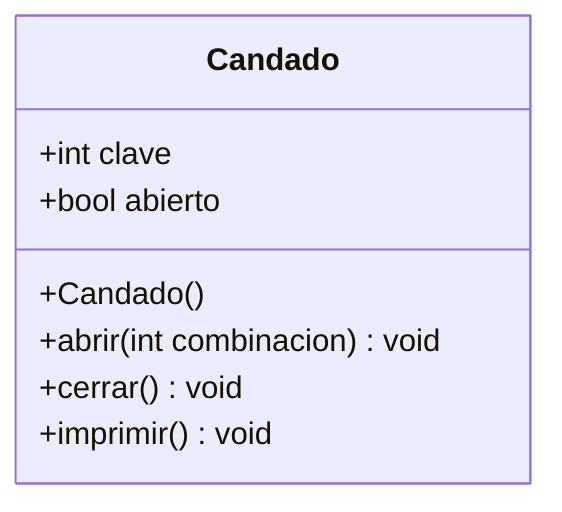

# A1 – Candados

## Diagrama de clase

```mermaid
classDiagram
    class Candado {
        +int clave
        +bool abierto
        +Candado()
        +abrir(int combinacion) void
        +cerrar() void
        +imprimir() void
    }
```
