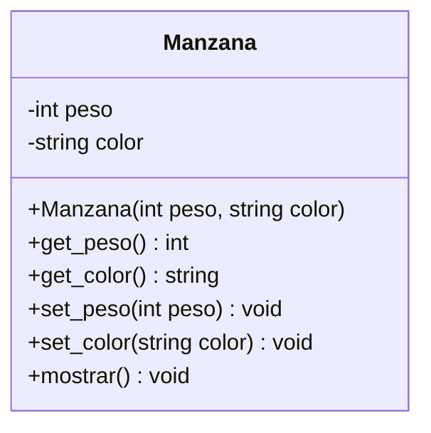

# A2 – Manzana

## Diagrama de clase

```mermaid
classDiagram
    class Manzana {
        -int peso
        -string color
        +Manzana(int peso, string color)
        +get_peso() int
        +get_color() string
        +set_peso(int peso) void
        +set_color(string color) void
        +mostrar() void
    }
```
