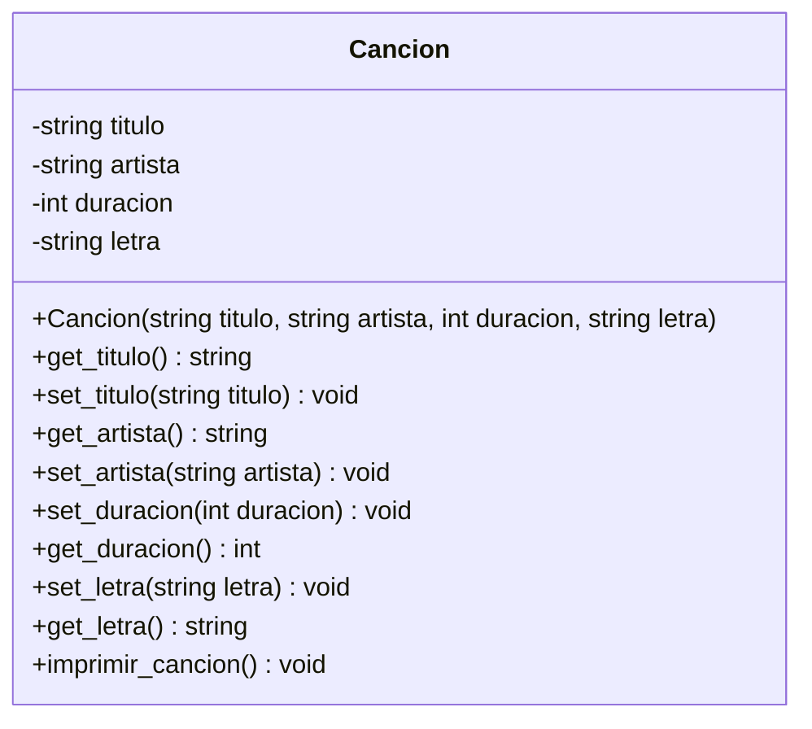

# A4 – Cancionero

## Diagrama de clase

```mermaid
classDiagram
    class Cancion {
        -string titulo
        -string artista
        -int duracion
        -string letra
        +Cancion(string titulo, string artista, int duracion, string letra)
        +get_titulo() string
        +set_titulo(string titulo) void
        +get_artista() string
        +set_artista(string artista) void
        +set_duracion(int duracion) void
        +get_duracion() int
        +set_letra(string letra) void
        +get_letra() string
        +imprimir_cancion() void
    }
```
