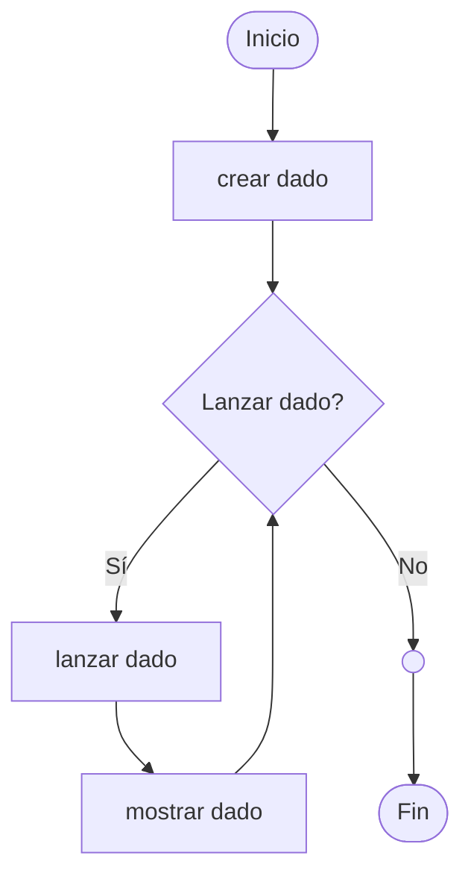
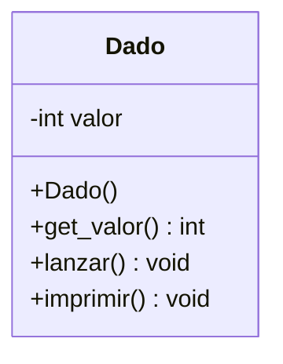

# B1 – Dados I

## Diagrama de flujo

```mermaid
flowchart TD
    A([Inicio]) --> B[crear dado]
    B --> C{Lanzar dado?}
    C -- Sí --> D[lanzar dado]
    D --> E[mostrar dado]
    E --> C
    C -- No --> F((" "))
    F --> G([Fin])
```

## Diagrama de clase

```mermaid
classDiagram
    class Dado {
        -int valor
        +Dado()
        +get_valor() int
        +lanzar() void
        +imprimir() void
    }
```
