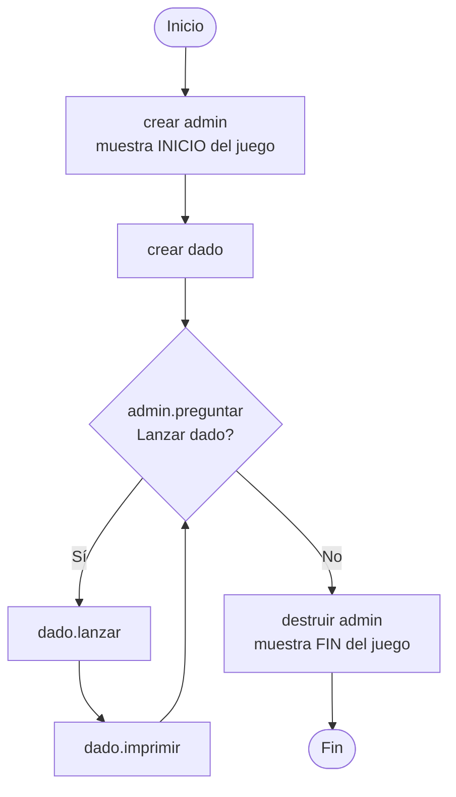
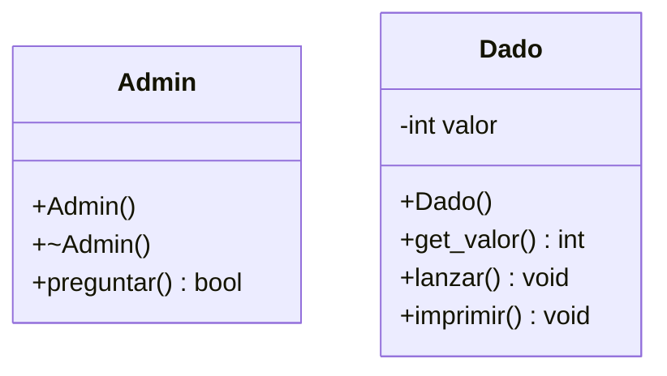

# B2 – Dados II

## Diagrama de flujo

```mermaid
flowchart TD
    A([Inicio]) --> B[crear admin<br/>muestra INICIO del juego]
    B --> C[crear dado]
    C --> D{admin.preguntar<br/>Lanzar dado?}
    D -- Sí --> E[dado.lanzar]
    E --> F[dado.imprimir]
    F --> D
    D -- No --> G[destruir admin<br/>muestra FIN del juego]
    G --> H([Fin])
```

## Diagrama de clases

```mermaid
classDiagram
    class Admin {
        +Admin()
        +~Admin()
        +preguntar() bool
    }
    class Dado {
        -int valor
        +Dado()
        +get_valor() int
        +lanzar() void
        +imprimir() void
    }
```
