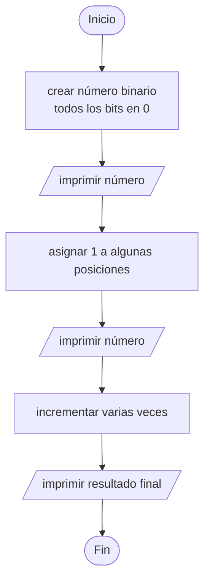
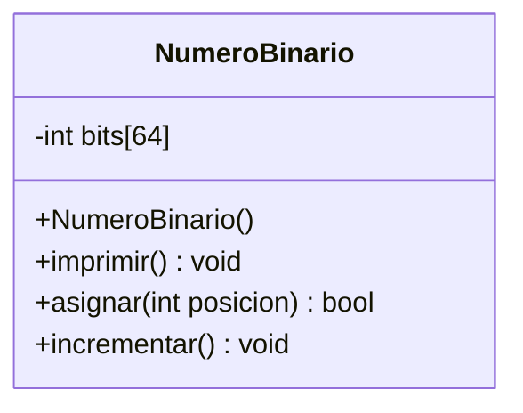

# B3 – Números binarios

## Diagrama de flujo

```mermaid
flowchart TD
    A([Inicio]) --> B[crear número binario<br/>todos los bits en 0]
    B --> C[/imprimir número/]
    C --> D[asignar 1 a algunas posiciones]
    D --> E[/imprimir número/]
    E --> F[incrementar varias veces]
    F --> G[/imprimir resultado final/]
    G --> H([Fin])
```

## Diagrama de clase

```mermaid
classDiagram
    class NumeroBinario {
        -int bits[64]
        +NumeroBinario()
        +imprimir() void
        +asignar(int posicion) bool
        +incrementar() void
    }
```
