# Ejercicios propuestos – Semana 8 (POO)

Ejercicios adicionales para los alumnos que terminen antes. Solo usan lo visto en la Semana 8: **clase, constructor, getters/setters, `this`, `const` y `vector` de objetos** (sin relaciones entre clases ni herencia).

| # | Ejercicio | Tipo | Tiempo aprox. |
|---|-----------|------|---------------|
| 1 | NumeroBinario → decimal | Extensión de B3 | 5–10 min |
| 2 | NumeroBinario → decrementar | Extensión de B3 | 10 min |
| 3 | Dado → estadísticas | Extensión de B1 | 10–15 min |
| 4 | Dado de N caras | Extensión de B1 | 10 min |
| 5 | CuentaBancaria | Nuevo | 15–20 min |
| 6 | Termómetro | Nuevo | 15 min |
| 7 | Semáforo | Nuevo | 15 min |
| 8 | Fracción | Nuevo | 20–25 min |
| 9 | Tragamonedas | Reto | 20–25 min |

---

## 1. NumeroBinario → decimal

**Enunciado.** Agregue a la clase `NumeroBinario` el método `valor_decimal() const`, que devuelva el valor del número en base 10. Para ello sume 2i por cada posición `i` cuyo bit valga 1. Úselo para comprobar que `incrementar()` funciona: el valor debe aumentar en 1 cada vez.

**Conceptos:** método `const`, recorrido del arreglo interno.

**Diagrama de clase**

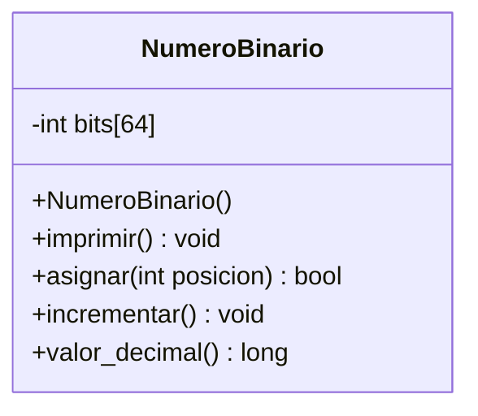

> En C++ el tipo de retorno sería `unsigned long long`, para que quepan los 64 bits.

**Diagrama de flujo – `valor_decimal()`**

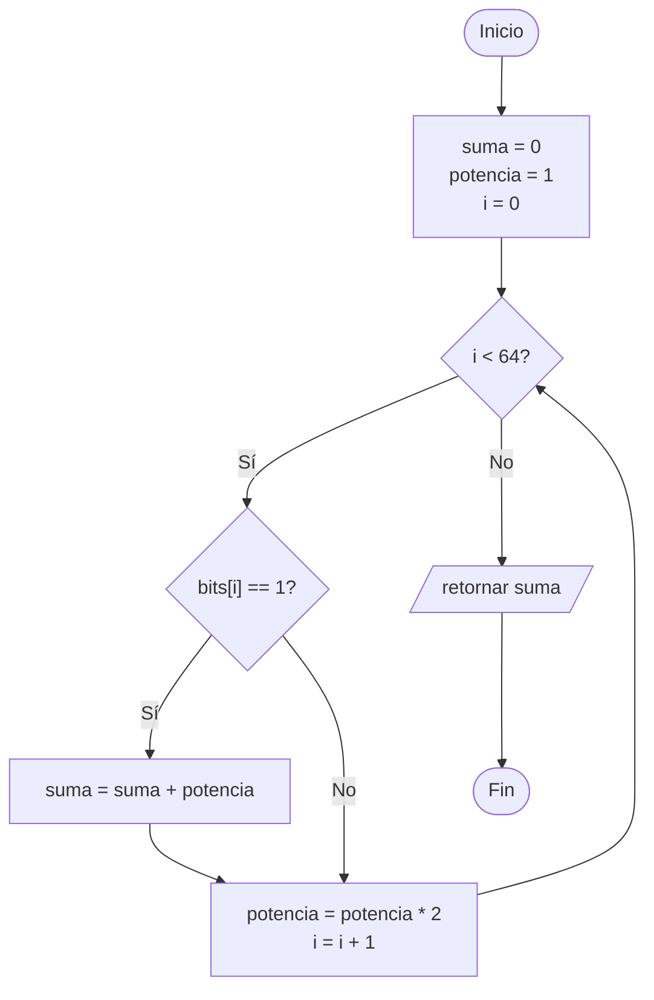

---

## 2. NumeroBinario → decrementar

**Enunciado.** Agregue el método `decrementar()`, inverso de `incrementar()`. Empieza en el bit menos significativo (`bits[0]`):

- Si el bit es **1**, pasa a 0 y termina.
- Si el bit es **0**, pasa a 1 (se "pide prestado") y continúa con el siguiente bit.

Pruebe: incrementar 5 veces y decrementar 5 veces debe devolver el número original.

**Conceptos:** algoritmo sobre el estado interno del objeto, simetría con un método existente.

**Diagrama de clase**

**Diagrama de flujo – `decrementar()`**

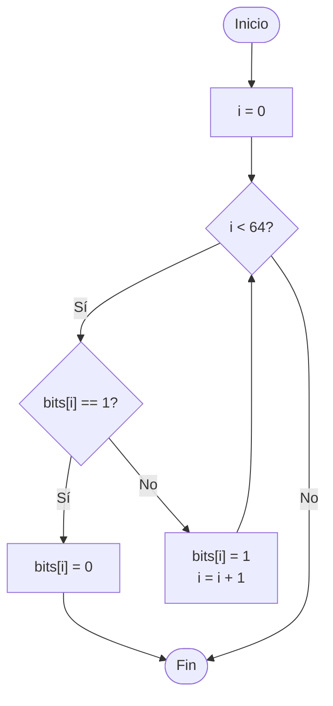

---

## 3. Dado → estadísticas

**Enunciado.** Usando la clase `Dado` de B1, lance un dado **600 veces** y cuente cuántas veces salió cada cara (use un arreglo `int conteo[6]`). Muestre el resultado. Cada cara debería aparecer cerca de 100 veces.

**Conceptos:** reutilizar una clase existente, `get_valor()`, uso del objeto dentro de un bucle.

**Diagrama de clase** (sin cambios respecto a B1)

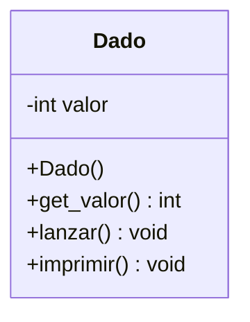

**Diagrama de flujo – programa principal**

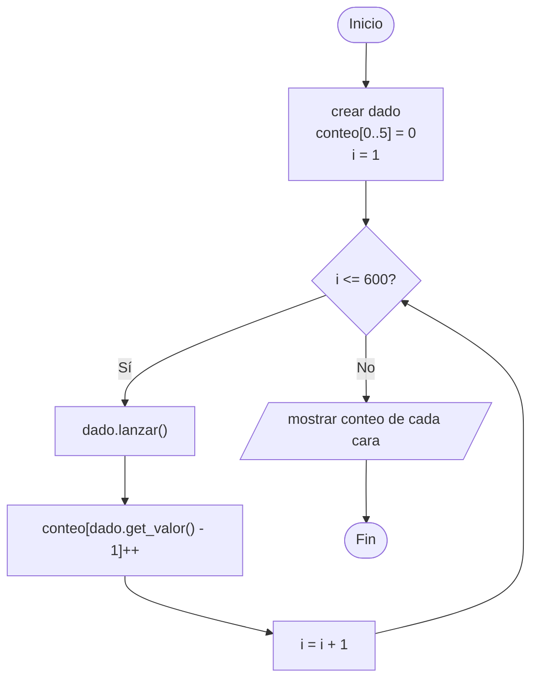

---

## 4. Dado de N caras

**Enunciado.** Modifique la clase `Dado` para que tenga un atributo `caras` y un **segundo constructor** `Dado(int caras)`. El constructor sin parámetros crea un dado de 6 caras. `lanzar()` debe generar un valor entre 1 y `caras`. Pruebe con dados de 4, 8, 12 y 20 caras.

**Conceptos:** sobrecarga de constructores, atributo usado en un método.

**Diagrama de clase**

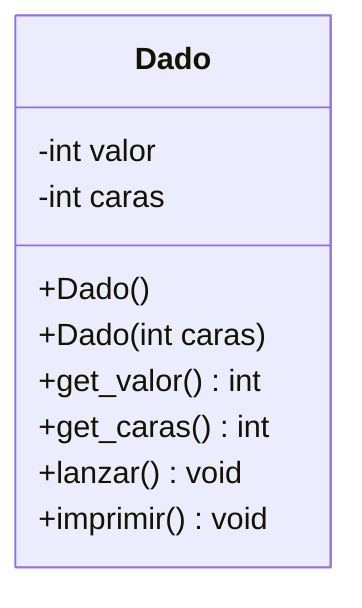

**Diagrama de flujo – programa principal**

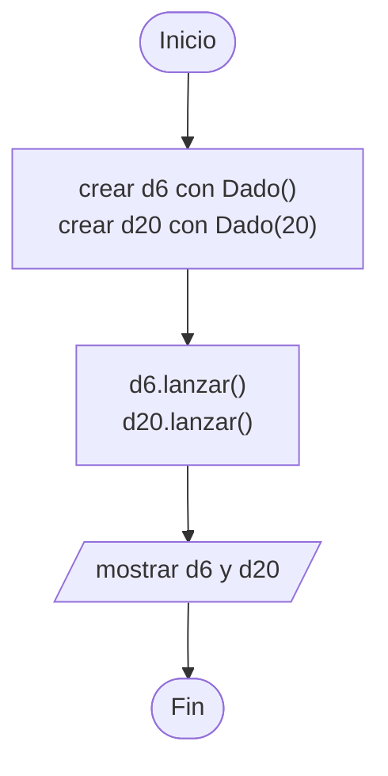

---

## 5. CuentaBancaria

**Enunciado.** Cree la clase `CuentaBancaria` con atributos privados `titular` y `saldo`.

- El constructor recibe el titular y un saldo inicial (si es negativo, se deja en 0).
- `depositar(monto)`: solo acepta montos positivos.
- `retirar(monto) : bool`: si hay saldo suficiente, retira y devuelve `true`; si no, no cambia nada y devuelve `false`.
- `imprimir() const`: muestra titular y saldo.

En el `main`, cree una cuenta y presente un menú: 1) depositar, 2) retirar, 3) ver saldo, 4) salir.

**Conceptos:** encapsulamiento (el saldo no se puede modificar directamente), validación dentro de los métodos, `const string&`.

**Diagrama de clase**

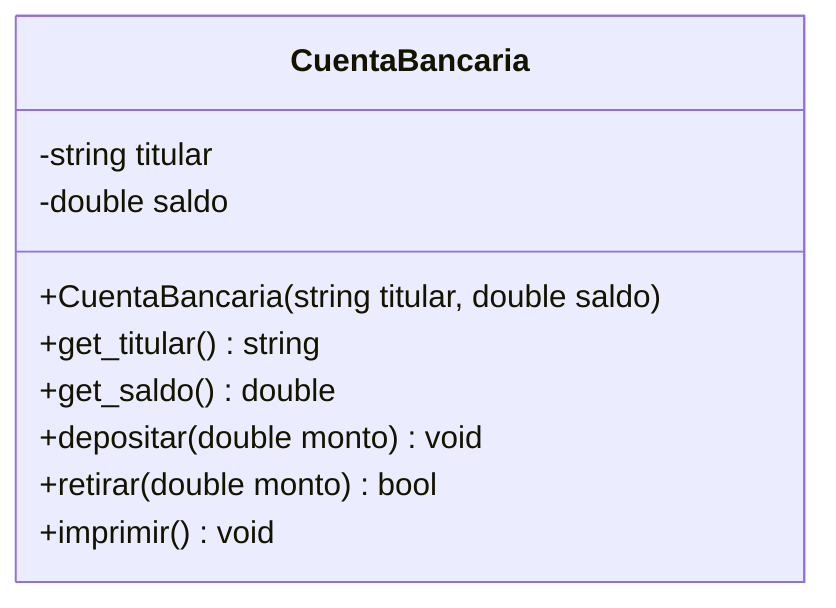

**Diagrama de flujo – programa principal**

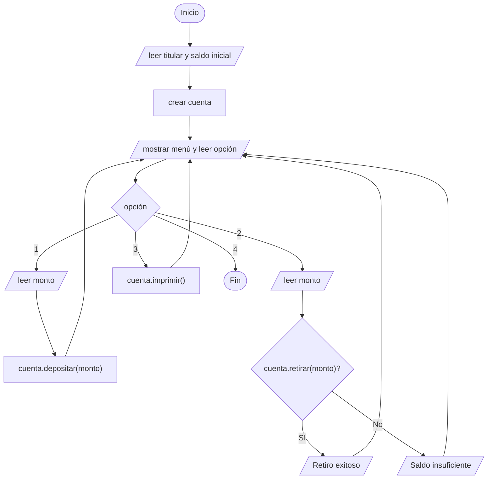

---

## 6. Termómetro

**Enunciado.** Cree la clase `Termometro` que guarde la temperatura **solo en grados Celsius** (un único atributo). Debe permitir leerla y modificarla en ambas escalas:

- `get_celsius()` / `set_celsius(c)`
- `get_fahrenheit()` / `set_fahrenheit(f)`, que convierten con F = C × 9/5 + 32.

No se permiten temperaturas por debajo del cero absoluto (−273.15 °C): en ese caso el setter ignora el valor.

**Conceptos:** un getter/setter no tiene por qué corresponder a un atributo; el objeto oculta cómo guarda sus datos.

**Diagrama de clase**

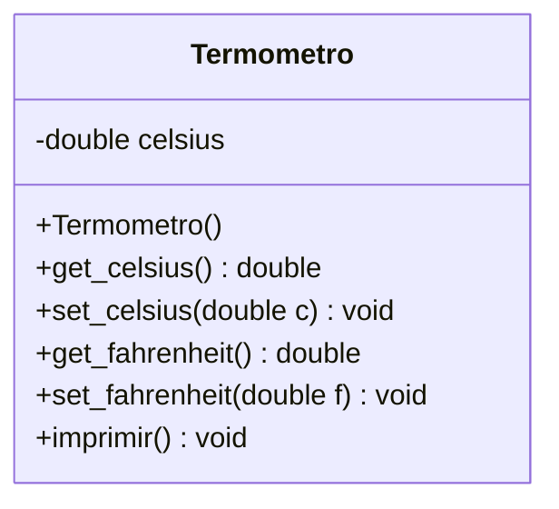

**Diagrama de flujo – `set_fahrenheit(f)`**

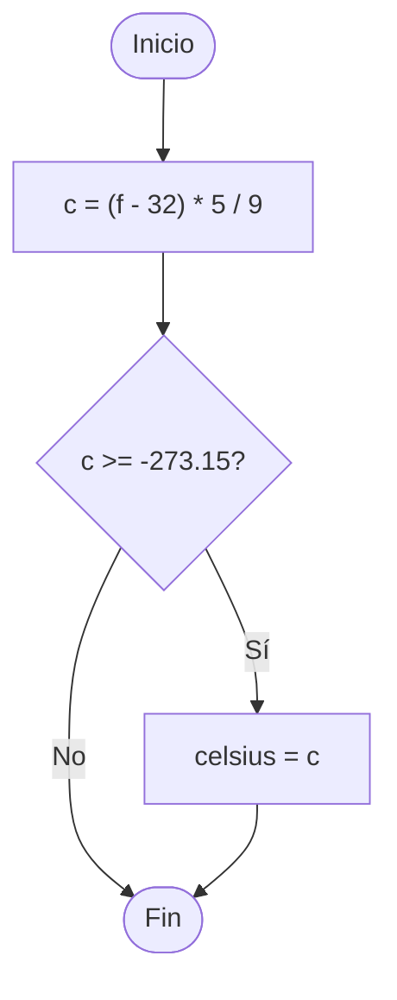

---

## 7. Semáforo

**Enunciado.** Cree la clase `Semaforo` con un atributo `estado` (0 = verde, 1 = amarillo, 2 = rojo). El constructor inicia en verde.

- `avanzar()`: pasa al siguiente estado en ciclo (verde → amarillo → rojo → verde).
- `imprimir() const`: muestra el emoji del estado actual (🟢 🟡 🔴).

En el `main`, simule 10 cambios de luz.

**Conceptos:** estado interno que cambia con los métodos, uso de `%` para ciclar.

**Diagrama de clase**

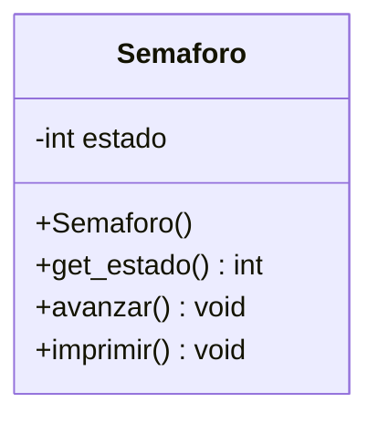

**Diagrama de flujo – programa principal**

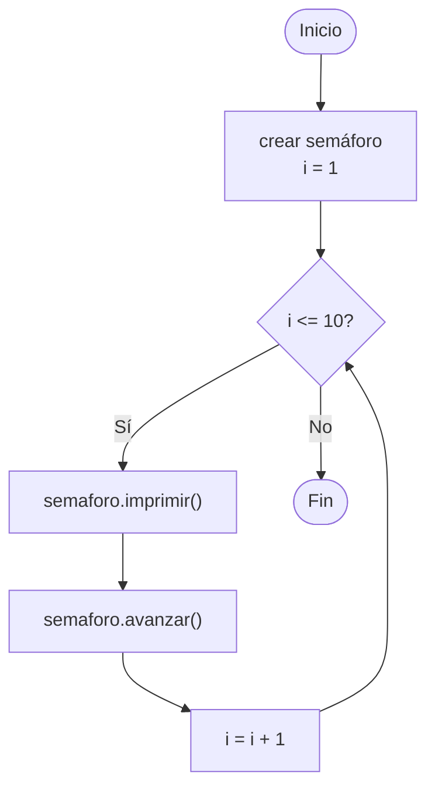

> `avanzar()` se resuelve en una línea: `estado = (estado + 1) % 3;`

---

## 8. Fracción

**Enunciado.** Cree la clase `Fraccion` con atributos `numerador` y `denominador`.

- El constructor recibe ambos valores. Si el denominador es 0, se asigna 1.
- `simplificar()`: divide numerador y denominador entre su MCD (implemente el MCD con el algoritmo de Euclides como método privado).
- `imprimir() const`: muestra la fracción como `a/b`.
- `valor() const`: devuelve el valor decimal.

Pruebe con 6/8 → 3/4 y 10/5 → 2/1.

**Conceptos:** validación en el constructor, **método privado** auxiliar, reutilizar funciones de semanas anteriores (recursividad).

**Diagrama de clase**

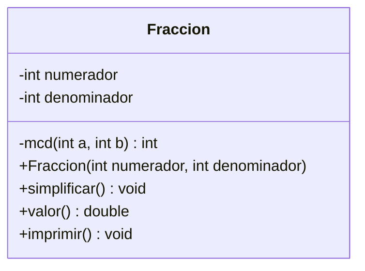

**Diagrama de flujo – `simplificar()`**

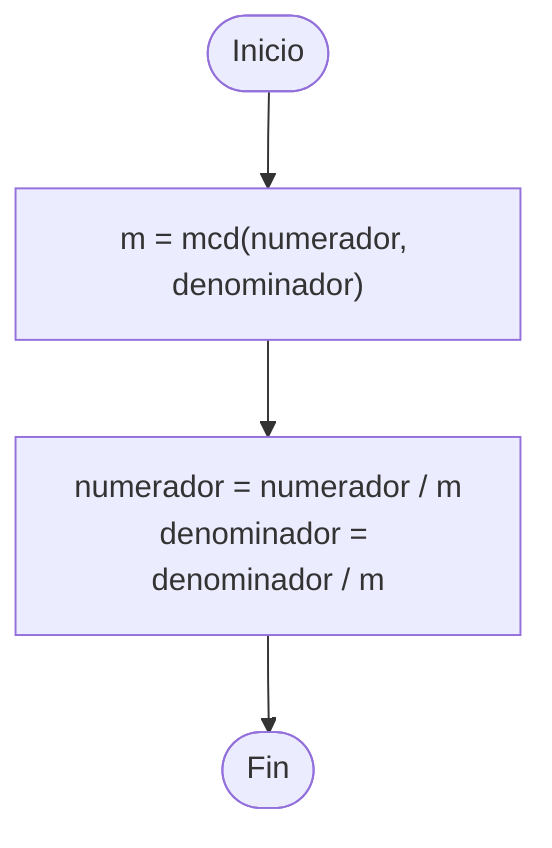

---

## 9. Tragamonedas (reto)

**Enunciado.** Usando la clase `Dado` de B1, cree un tragamonedas con **tres dados**. En cada jugada se lanzan los tres; se gana cuando los tres muestran el mismo valor. El programa repite jugadas hasta ganar y al final muestra cuántos intentos fueron necesarios.

Variante: guardar los tres dados en un `vector<Dado>`.

**Conceptos:** varios objetos de la misma clase, reutilizar una clase ya hecha, bucle con condición sobre el estado de los objetos.

**Diagrama de clase** (se reutiliza `Dado` de B1)

**Diagrama de flujo – programa principal**

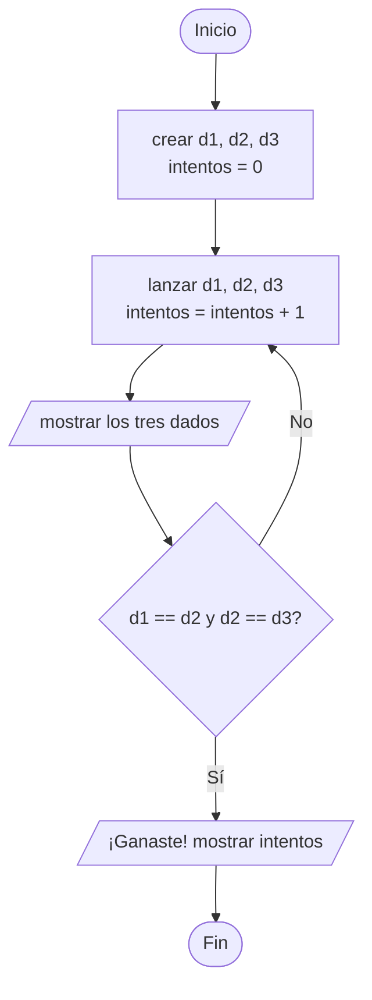
